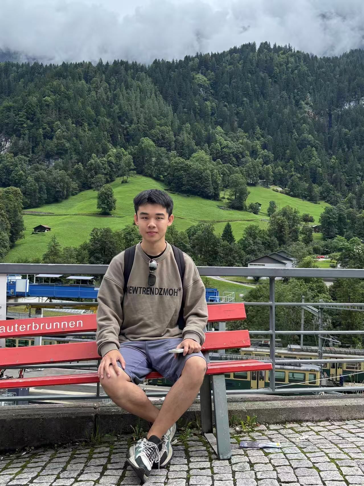

# Page

I'm currently pursuing a Master's degree in Computer Architecture and Data Processing Unit (DPU) Optimization at Paris-Saclay University. My research interests include DPU scheduling, simulation, performance evaluation, and compiler optimization for specialized processing architectures.

Previously, I completed the first year of my Master's degree at École Polytechnique in Paris, majoring in Computer Science. I received my Bachelor's degree in Computer Science from Beijing University of Posts and Telecommunications.

